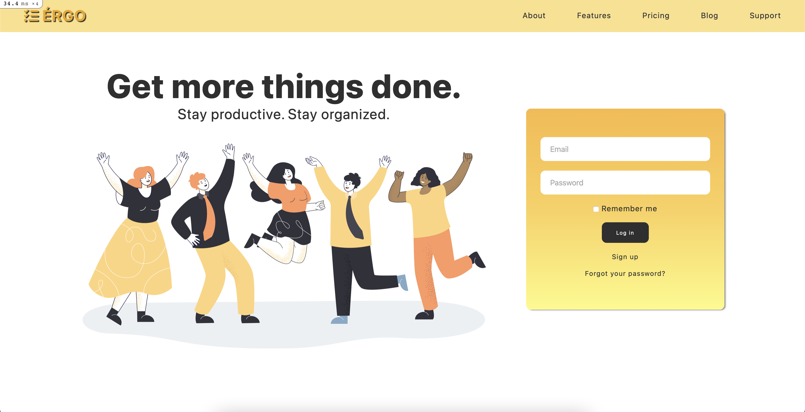
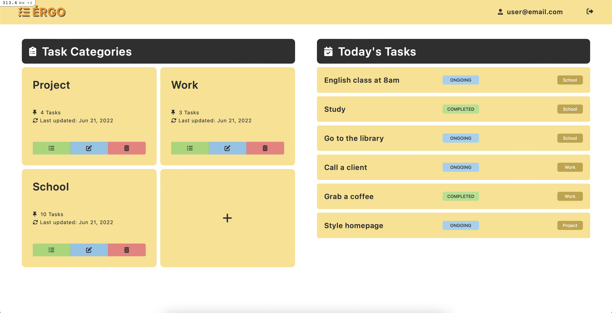
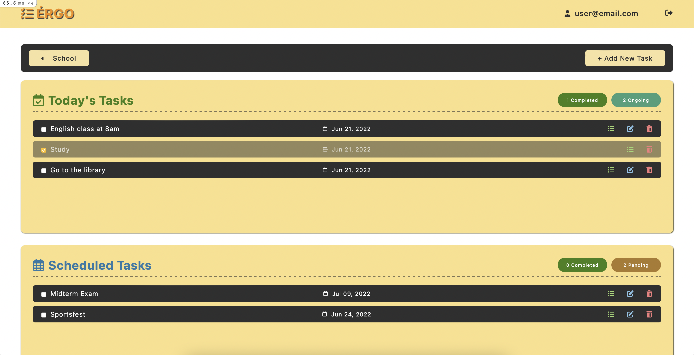
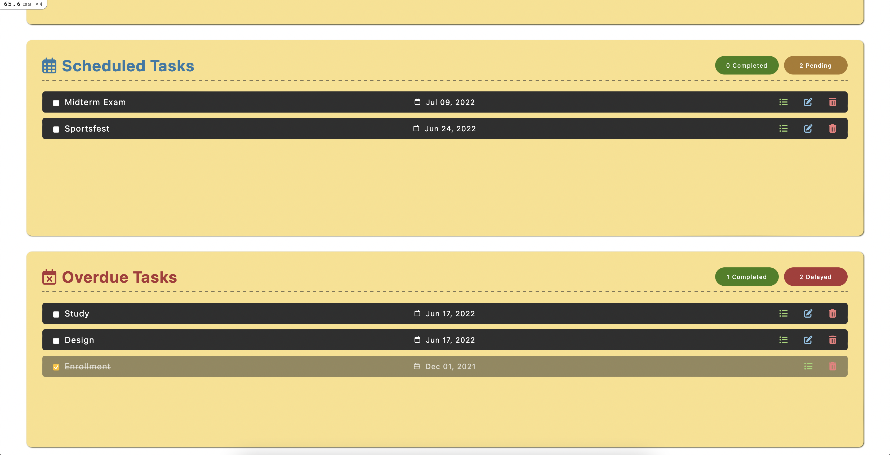

### ✨ [Journal App (Click to see live version)](https://ergo-journal-app.herokuapp.com/)

>> ###### Features:
>> - Log in and sign up with devise
>> - Add, view, edit, and delete categories
>> - View all today's task
>> - Scheduled and overdue tasks
>> - Add, view, edit, and delete tasks
>> - Shows task status

 

>> ###### Sources:
>> - Heartcombo's [Devise Tutorial](https://github.com/heartcombo/devise)
>> - Vector image: [Freepik.com](https://www.freepik.com/free-vector/team-happy-office-workers-celebrating-professional-victory_19216895.htm#page=2&query=happy%20office%20worker%20vector&position=4&from_view=search)
>> - Ruby on Rails's [Guides](https://guides.rubyonrails.org/v6.1/)
